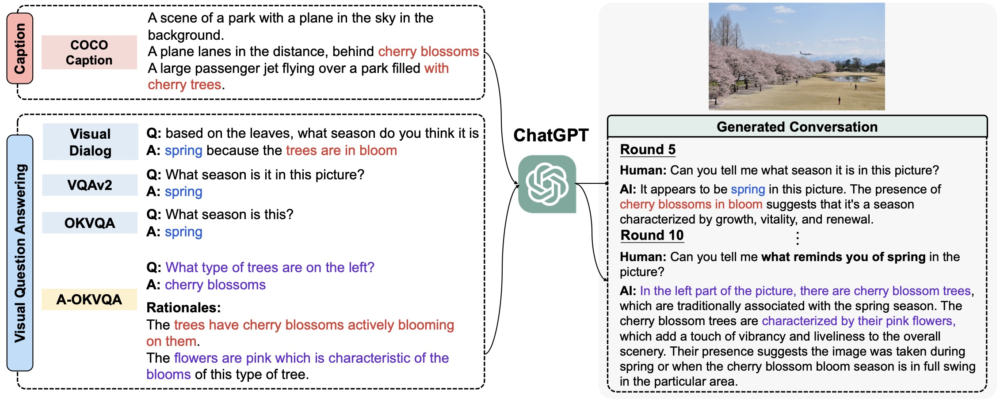
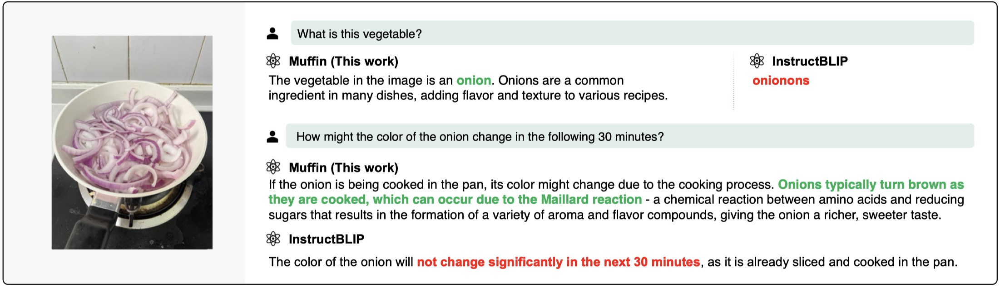
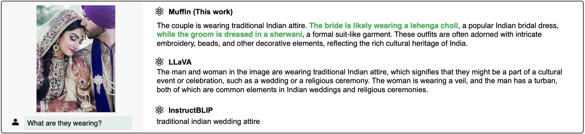
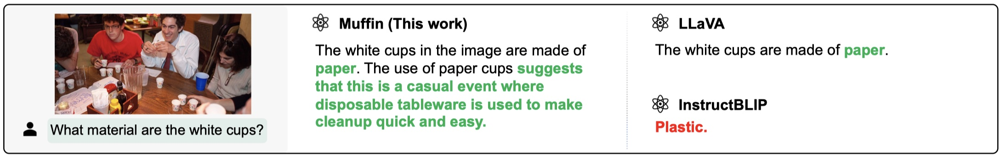

<div align="center">

# 🥞 Muffin

**Multimodal foundation models are found to be “out-of-the-box” multimodal interfaces for LLMs**
<p align="center">
  <a href="#Serving">🔥 Try It Now!</a> •
  <a href="#Install">🔧 Install</a> •
  <a href=#Fine-tuning> 🙌 Build Your Muffin </a>
  <a href='https://arxiv.org/pdf/2310.00653.pdf'> 📄 Our Paper </a>
</p>

</div>


## Reformulating Vision-Language Foundation Models and Datasets Towards Universal Multimodal Assistants

### Models

Multimodal foundation models (MFMs) are natives of multiple modalities and can serve as better bridegs from different modalities towards LLMs. It is because MFMs can naturally encode the feature from other modalities (such as vision, audio) into the same space as language, which consequently better activate the capability of LLMs. We also list some [examples](#examples) generated by our Muffin to demonstrate the effectiveness.

### Datasets

Demonstration of the framework designed for constructing the UniMM-Chat dataset. UniMM-Chat combines various VL datasets to generate knowledge-intensive dialogues. Text spans highlighted in colors indicate different knowledge from origin annotations which are required to answer the questions.



### Benchmarks


## Examples

We list some representative cases to demonstrate the power of Muffin. We refer readers to our paper for more examples, and you can deploy a web-demo following the [instructions](#serving).

### Outside Knowledge Visual QA




### Culture



### Helpful




## Contents
- [Data](#data)
- [Install](#install)
- [Muffin Weights](#muffin-weights)
- [Serving](#serving)
- [Evaluation](#evaluation)
- [Fine-tuning](#fine-tuning)

## Data

### Pre-training Data

The pre-training data used in this release are all public data include CC-3M, CC-12M, COCO, Visual Genome, LAION-COCO.

### Instruction Following Data

We present the [UniMM-Chat](https://huggingface.co/datasets/Yirany/UniMM-Chat) dataset, which is constructed for visual instruction tuning and expected to be helpful in improving models' capabilities to solve different tasks without harming their generation ability.

During training, we use both the UniMM-Chat and the [LLaVA-Instruct-150K]((https://github.com/haotian-liu/LLaVA#data-download)) dataset during training. To download our langauge-image multimodal instruction-folllowing dataset , please run the following script:

```bash
bash ./script/download_data.sh
```


## Install

1. Clone this repository and navigate to source folder
```bash
git clone https://github.com/thunlp/muffin
cd muffin
```

2. Download training data and install dependencies.
```Shell
bash ./script/init.sh
```


## Muffin Weights

We release Muffin weights on [Hugging Face](https://huggingface.co/Yirany/Muffin-13B/tree/main) (still uploading, will be available soon). To load Muffin for inference:

```py
from muffin.eval.muffin_vqa import init_muffin

model, image_processor, image_token_len, tokenizer = init_muffin('Yirany/Muffin-13B')
```


### Muffin pretrained weights

We also provice the [pretrained Muffin weights](https://huggingface.co/Yirany/Muffin-13B-pretrained/tree/main) (uploading, will be available soon) without training on instruction following data.

## Serving

### Web UI

#### Launch a controller

```Shell
python -m muffin.serve.controller --host 0.0.0.0 --port 10000
```

#### Launch a model worker
```Shell
python -m muffin.serve.muffin_worker --host 0.0.0.0 --controller http://localhost:10000 --port 40000 --worker http://localhost:40000 --model-path Yirany/Muffin-13B --multi-modal
```
Wait until the process finishes loading the model and you see "Uvicorn running on ...".

#### Launch a model worker (Multiple GPUs, when GPU VRAM <= 24GB)

If your the VRAM of your GPU is less than 24GB (e.g., RTX 3090, RTX 4090, etc.), you may try running it with multiple GPUs.

```Shell
python -m muffin.serve.muffin_worker --host 0.0.0.0 --controller http://localhost:10000 --port 40000 --worker http://localhost:40000 --model-path Yirany/Muffin-13B --multi-modal --num-gpus 2
```
Wait until the process finishes loading the model and you see "Uvicorn running on ...".


#### Launch a gradio web server.

```Shell
python -m muffin.serve.gradio_web_server --controller http://localhost:10000
```
#### You can open your browser and chat with a model now.

## Evaluation

Our GPT-assisted evaluation pipeline for multimodal modeling is provided for a comprehensive understanding of the capabilities of vision-language models.  Please see our [paper](https://arxiv.org/abs/2310.00653) for more details.

1. Generate responses

```Shell
bash ./script/eval/eval_muffin_qa.sh your_checkpoint_dir
```

2. Evaluate the generated responses.

```Shell
bash ./script/eval/batch_gpt4_review.sh your_checkpoint_dir
```

3. Summarize the evaluation results

```Shell
python ./eval/summarize_gpt_llava_review.py your_checkpoint_dir
python ./eval/summarize_gpt_unimm-bench_review.py your_checkpoint_dir
```

## Fine-tuning


```Shell
bash ./script/train/run_unimm-chat.sh ./output/checkpoints master finetune_muffin ./data/coco_images
```

## Licenses


[](https://github.com/tatsu-lab/stanford_alpaca/blob/main/LICENSE)
[](https://github.com/tatsu-lab/stanford_alpaca/blob/main/DATA_LICENSE)

**Usage and License Notices**: The data, code and checkpoint is intended and licensed for research use only. They are also restricted to uses that follow the license agreement of LLaMA, Vicuna and Chat GPT. The dataset is CC BY NC 4.0 (allowing only non-commercial use) and models trained using the dataset should not be used outside of research purposes.


## Acknowledgement

- [LLaVA](https://github.com/haotian-liu/LLaVA/tree/main/llava): the codebase we built upon, and our base model Vicuna-13B that has the amazing language capabilities!

If you find Muffin useful for your your research and applications, please cite using this BibTeX:
```bibtex
@misc{yu2023muffin,
      title={Reformulating Vision-Language Foundation Models and Datasets Towards Universal Multimodal Assistants},
      author={Tianyu Yu, Jinyi Hu, Yuan Yao, Haoye Zhang, Yue Zhao, Chongyi Wang, Shan Wang, Yinxv Pan, Jiao Xue, Dahai Li, Zhiyuan Liu, Hai-Tao Zheng, Maosong Sun},
      publisher={arXiv:2310.00653},
      year={2023},
}
```
